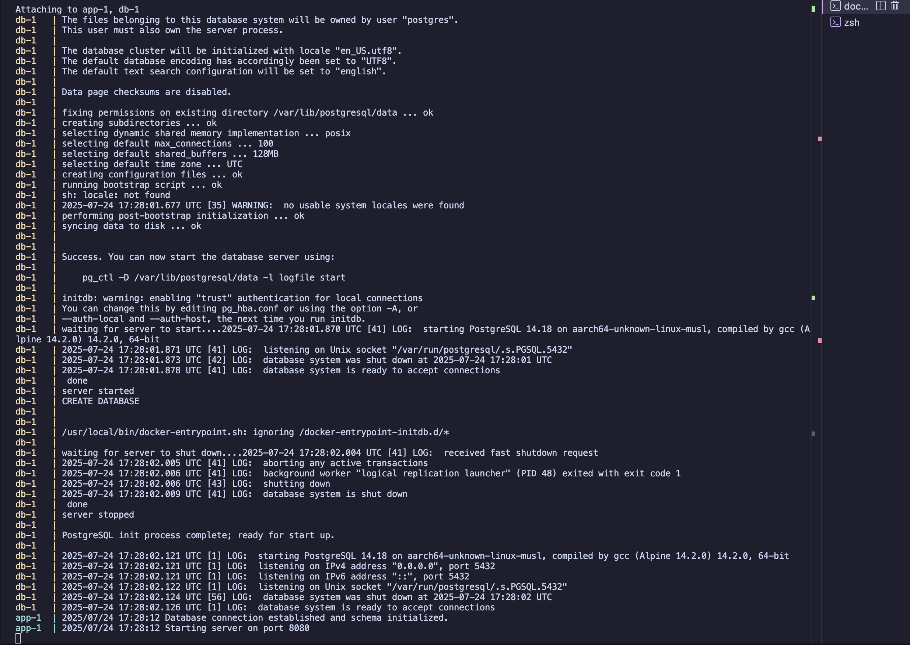
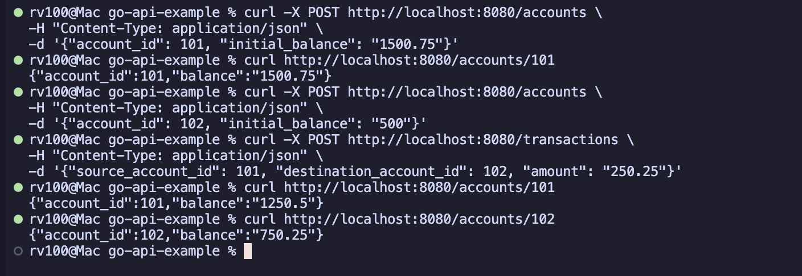
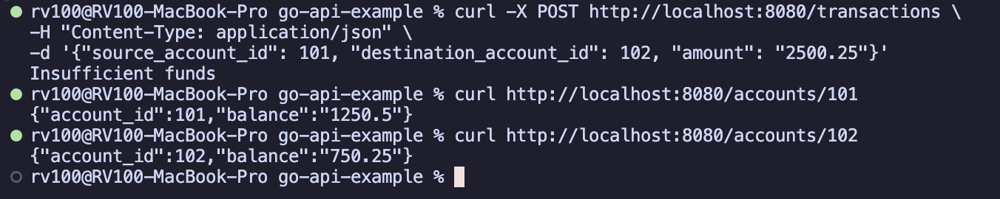

# go-api-example

This repo covers an example for a set of APIs in a golang that work together to solve a business use case.

The structure of this repository is as follows:

```text
go-api-example/
├── storage/
│   ├── postgres.go         # Database logic (queries, transactions)
│   └── postgres_test.go    # DB logic tests (requires test DB)
├── handler/
│   ├── account_handler.go  # HTTP handlers for accounts
│   ├── account_handler_test.go # Unit tests for account handlers
│   ├── transaction_handler.go# HTTP handlers for transactions
│   └── transaction_handler_test.go # Unit tests for transaction handlers
├── model/
│   └── model.go            # Data structures (Account, Transaction)
|── demo-images/            # Images of correct demo of happy-path (successful and correct response) and non-happy path (error response) behavior
├── main.go                 # Main application entrypoint (server setup)
├── go.mod                  # Go module definitions
├── go.sum                  # Go module checksums
├── Dockerfile              # Dockerfile for the Go application
└── docker-compose.yml      # Docker Compose for app and DB setup
└── README.md               # Detailed instructions about project setup and usage
└── docker_install_guide.md # Docker and Docker Compose installation guide
```

---

## Assumptions

* All accounts and transactions operate in a single, unspecified currency.
* Account IDs are provided by the client during creation.
* The system does not implement authentication or authorization.

---

## Prerequisites

* Docker
* Docker Compose
* Go (1.24.5) (for running tests locally)
* `curl` or a similar tool for making HTTP requests.

### Steps to install Docker and Docker Compose

Check out the [Docker and Docker Compose Installation Guide (Markdown file)](./docker_install_guide.md) for detailed instructions.

---

## How to Run

The simplest way to run the application and its database is with Docker Compose.

1.  **Clone or create the project files** in a single directory.

2.  **Build and start the services:**
    From the root of the project directory, run:
    ```sh
    docker-compose up --build
    go mod tidy
    ```
    This command will build the Go application image, start a PostgreSQL container, and run the application. The API will be available on `http://localhost:8080`.

---

## How to Run Tests

Unit Tests have been added in _test.go files in handler/ model/ and storage/ directories.

To run the unit tests, you don't need the Docker environment. Navigate to the project directory and run:

```sh
go test ./...
```

To run tests of any specific folder i.e. storage, we can execute:
```sh
go test ./storage -v
```

---

## API Endpoints

### 1. Create API

Creates a new account with a specified ID and initial balance. This endpoint is **idempotent**; if an account with the given ID already exists, it will succeed without creating a duplicate.

This is achieved vis optimistic locking using SQL command, specifically this part of the SQL command *"ON CONFLICT (account_id) DO NOTHING"*

- **Endpoint:** `POST /accounts`

#### Request Body

```json
{
  "account_id": 1001,
  "initial_balance": "1800.95"
}
```

#### Example cURL Command

```bash
curl -X POST http://localhost:8080/accounts \
-H "Content-Type: application/json" \
-d '{"account_id": 1001, "initial_balance": "1800.95"}'
```

#### Success Response
- **Status:** `201 Created` (if new) or `200 OK` (if it already existed)
- **Body:** Empty

---

### 2. Get Account Balance

Retrieves the details and current balance of a specific account.

- **Endpoint:** `GET /accounts/{account_id}`

#### Example cURL Command

```bash
curl http://localhost:8080/accounts/1001
```

#### Success Response

```json
{
  "account_id": 1001,
  "balance": "1800.95"
}
```

---

### 3. Submit API

Executes a transfer of a specified amount from a source account to a destination account. This operation is **atomic** and handles race conditions.

- **Endpoint:** `POST /transactions`

#### Request Body

```json
{
  "source_account_id": 1001,
  "destination_account_id": 1002,
  "amount": "250.25"
}
```

#### Example cURL Commands

```bash
# Create destination account
curl -X POST http://localhost:8080/accounts \
-H "Content-Type: application/json" \
-d '{"account_id": 1002, "initial_balance": "500"}'

# Perform the transfer
curl -X POST http://localhost:8080/transactions \
-H "Content-Type: application/json" \
-d '{"source_account_id": 1001, "destination_account_id": 1002, "amount": "250.25"}'
```

#### Success Response
- **Status:** `200 OK`
- **Body:** Empty

After these API calls, account ID 1001 should have the amount 1550.70 in it 
and account ID 1002 should have the amount 750.25 in it. (which is the correct happy path behavior)

---

## API Behavior Demonstration

The following images demonstrate the application running correctly via Docker Compose and showcase both happy and non-happy path API interactions.

### 1. Docker Compose Build

The `docker-compose up --build` command successfully builds the application and starts the API and postgres database services as expected.



### 2. API Happy Path Behavior

This shows the successful creation of two accounts and a valid transfer between them. The final balances are correct, confirming the transaction was processed successfully.



### 3. API Non-Happy Path Behavior (Insufficient Funds)

This demonstrates the system correctly handling an invalid request. An attempt to transfer more money than available in the source account is rejected with the appropriate "Insufficient funds" error message, and the balances remain unchanged.



---

# External Libraries used (apart from Golang Standard Library)

## Database and Data Handling
- *github.com/jackc/pgx/v5/pgxpool*: This is a high-performance PostgreSQL driver and connection pool for Go. It's used in storage/postgres.go to efficiently manage connections to the database, which is essential for a concurrent server application that handles multiple requests simultaneously.

- *github.com/shopspring/decimal*: This library provides an arbitrary-precision decimal number type. It is used in model/model.go to represent monetary values like account balances, preventing the rounding errors and inaccuracies inherent in standard floating-point types (float64).

## Testing
- *github.com/stretchr/testify/assert*: This is a testing toolkit that provides a rich set of assertion functions. It's used throughout the _test.go files to make test code more readable and expressive by replacing complex if statements with simple calls like assert.Equal().

- *github.com/stretchr/testify/require*: Similar to assert, this library provides assertion functions but with a key difference: it stops the test immediately upon failure. It is used for critical pre-conditions in tests, such as ensuring a database connection is established, because there is no point in continuing the test if the setup fails.

- *github.com/testcontainers/testcontainers-go*: This library allows for the programmatic creation and management of Docker containers for integration testing. In storage/postgres_test.go, it is used to spin up a real PostgreSQL database in a Docker container, ensuring that the storage layer is tested against a live, isolated database instance.

- *github.com/testcontainers/testcontainers-go/modules/postgres:* This is a specialized module for testcontainers-go that simplifies the setup of a PostgreSQL container. It provides convenient, pre-packaged configurations for running a PostgreSQL instance for testing purposes.

- *github.com/testcontainers/testcontainers-go/wait* This sub-package provides strategies to pause test execution until a container is fully ready to accept connections. In storage/postgres_test.go, it's used to wait for a specific log message from the PostgreSQL container, guaranteeing the database is ready before the tests begin.

## Web Routing
- *github.com/gorilla/mux*: This is a powerful HTTP router and URL matcher for building web applications. It's used in main.go to define the API endpoints, parse URL parameters (like /accounts/{account_id}), and direct incoming requests to the correct handler functions.
